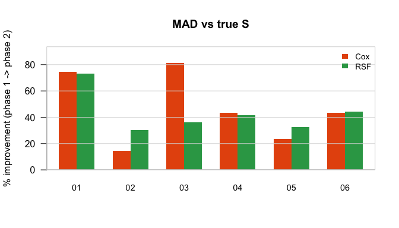
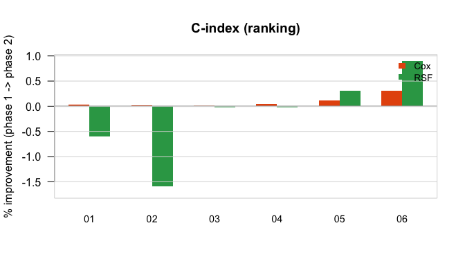
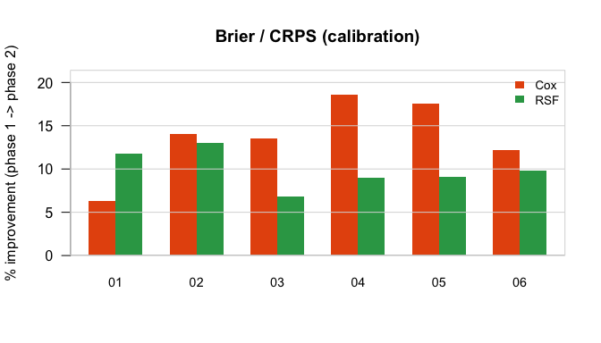

Results at a glance
================

Thin summary of all six simulations’ knitted results. For the DGP math,
true `S`/hazard, and PH verdicts, see `README.md` — this file is just
the numbers, computed directly from each sim’s `results_phases.rds`
(nothing here is hand-typed).

## What “phase 1 → phase 2” means

Every simulation fits the *same* entry-time-aware model
(`cox_lt`/`rsf_lt`) on the *same* replication twice:

- **Phase 1**: that model is given an entry vector of all zeros — i.e.
  “pretend nothing is truncated.”
- **Phase 2**: that same model is given the real, observed entry times.

So every number below is a **paired before/after comparison on one
model**, not a comparison against a different (standard) model. It
happens that phase 1 (entry = 0) is mathematically proven identical to
the plain/standard model’s own score (the “noop” check each sim’s report
also shows), so in practice this also tells you standard-vs-entry-aware
— but the actual quantity being computed is: *does giving this model the
real entry time improve it, relative to giving it no truncation
information at all?*

> **Run size:** 10 replications per simulation, 200 test subjects each.
> This is a smoke-test run — enough to confirm the pipeline works end to
> end, not to pin down the numbers. Treat the percentages as
> provisional: the near-zero C-index entries in particular cannot be
> told apart from Monte Carlo noise at this replication count. The
> production run is 100 replications.

Every column is **% improvement from supplying the real entry time**
(`(phase1 - phase2) / phase1 * 100`). All three metrics are
lower-is-better, so positive = entry time helped; negative = it made
that arm/metric worse.

| \# | DGP | MAD Cox | MAD RSF | C-idx Cox | C-idx RSF | Brier Cox | Brier RSF |
|:---|:---|:---|:---|:---|:---|:---|:---|
| 01 | Cox PH (exactly Cox) | 74.73% | 73.05% | 0.03% | -0.60% | 6.35% | 11.82% |
| 02 | Gompertz-shape (PH violation) | 14.57% | 30.11% | 0.02% | -1.59% | 14.01% | 13.02% |
| 03 | RIST Sc.1 (exactly Cox) | 81.38% | 35.95% | 0.00% | -0.03% | 13.51% | 6.84% |
| 04 | RIST Sc.2 (nonlinear link) | 43.54% | 41.62% | 0.04% | -0.02% | 18.61% | 8.96% |
| 05 | RIST Sc.3 (Gamma, PH violation) | 23.61% | 32.46% | 0.12% | 0.31% | 17.54% | 9.07% |
| 06 | RIST Sc.4 (Lognormal, PH violation) | 43.20% | 44.37% | 0.31% | 0.89% | 12.18% | 9.87% |

## By metric

Same numbers as the table above, as three small multiples (one axis each
— MAD, C-index, and Brier live on very different scales, so one shared
axis would be misleading). The zero line is the reference: bars crossing
below it are where entry time made that arm/metric *worse*, which only
shows up for RSF’s C-index in a few sims.

<!-- -->

<!-- -->

<!-- -->

Raw phase-table numbers (all three metrics, all six sims) are in each
sim’s `results_phases.rds` / knitted `stage1_main.html`.
